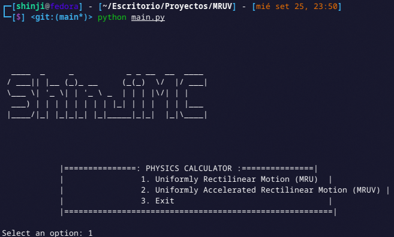
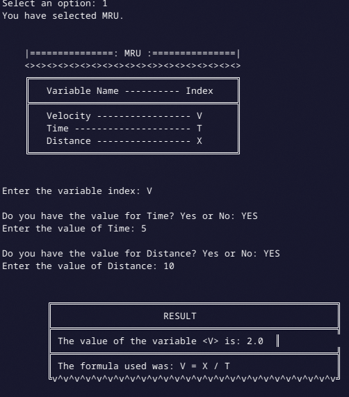
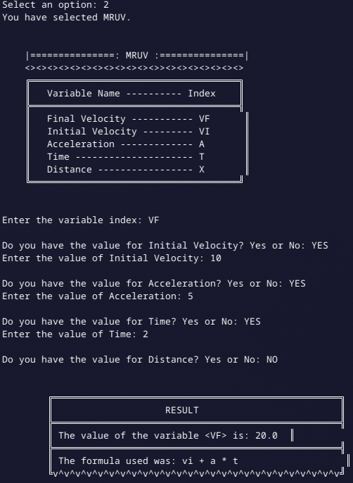

# Physics Calculator: MRU - MRUV

By Braulio Nayap Maldonado Casilla

<div align="center">
  
  


[]()


</div>

## Description

The **ZSH Setup Configuration Pro with Pokemon Color Scripts** is a comprehensive setup script designed to configure your ZSH shell environment with essential tools, plugins, and a visually enhanced setup. This script also provides an optional installation of Pokemon color scripts to personalize your terminal experience.

## Visuals



## Screenshots




## Requirements

- `python3` - for pokemon color scripts
- `git` - for version control

## Installation

1. **Clone the repository:**

   ```bash
   git clone https://github.com/ShinjiMC/MRU-MRUV-Calculator.git
   ```

2. **Navigate to the project directory:**

   ```bash
   cd MRU-MRUV-Calculator
   ```

3. **Run the installation script:**

   ```bash
   python main.py
   ```
